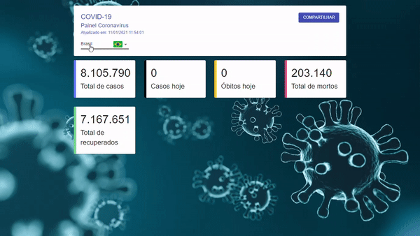

# Dados COVID-19 - PWA (projeto DIO)

Projeto desenvolvido durante bootcamp de React da DIO (Digital Innovation One)

O projeto consiste em uma PWA (Progressive Web Application) que exibe dados de casos da COVID-19 pelo mundo.

## Tecnologias e ferramentas utilizadas :hammer_and_wrench:

- JavaScript
- ReactJS
- material-ui
- styled-components
- axios


## Para executar o projeto :computer:

- clone este repositório 

  ```
  git clone https://github.com/davi-santos5/dio-covid19.git
  ```

- instale as dependências

  ````
  yarn add
  ````

- execute o projeto

  ```
  yarn start
  ```


Ou acesse a aplicação: [Casos de COVID-19 (dio-covid19-pwa.netlify.app)](https://dio-covid19-pwa.netlify.app/)



